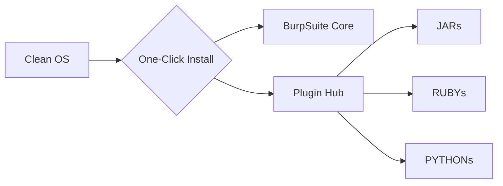

# ⚡ BurpFusion-Core 
> **One-Click Install | Zero-Config | Plugins Zero Compilation**  

**Stop wasting hours on setup!** This toolkit delivers a production-ready BurpSuite with hot plugins environment in **under 60s**
-  no compilation, no dependency hell, just pure security test.

---


---

## 🚀 Why This Beats Manual Setup
| Feature | Traditional Method | Our Solution |
|---------|-------------------|-------------|
| **Plugin Installation** | Manual download + jar management | ✅ Auto-curated plugin hub |
| **Dependency Handling** | Ruby/Python env struggles | ✅ All-inclusive runtime |
| **Updates** | Manual tracking | ✅ Auto-sync plugin registry |

## 🧩 Pre-Integrated Elite Plugins (No Build Needed!)
```diff
+ BurpGPT          - Integrates OpenAI's GPT to perform passive scan and traffic-based analysis
+ Nuclei-Burp-Plugin - Nuclei plugin for BurpSuite
+ Burp-Awesome-TLS   - Evade TLS fingerprinting, Bypass WAF, spoof any browser
! more hot tools coming...
```
> 🔥 **Zero Compilation Advantage**: All plugins ship as verified `.jar` files
> - no Maven/Gradle/Python environments required!


**What happens in 60 seconds**:
1. 📥 Downloads verified BurpSuite binaries
2. 🧩 Installs hot plugins from authenticated mirrors


## 🤖 Technical Wizardry Inside


> ✨ **No Python/Java/Ruby** - Our smart wrapper handles everything in native binaries

---

## 📜 Legal Compliance
```diff
- NOT affiliated with PortSwigger Ltd.
+ Includes automatic trademark disclaimer injection
```

[](https://github.com/your/repo/releases/latest)

