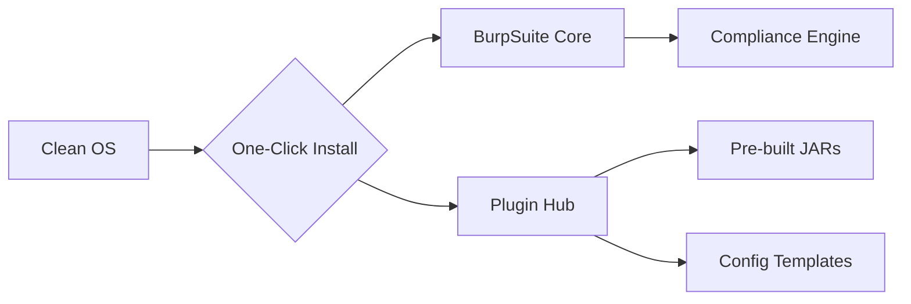

```markdown
[](https://)
[](https://)
[](https://)

# ⚡ BurpSuite Ultimate Installer  
> **Zero-Config | No Build Required**  

**Stop wasting hours on setup!** This toolkit delivers a production-ready BurpSuite environment in **under 60 seconds** -  
no compilation, no dependency hell, just pure security testing power.

## 🚀 Why This Beats Manual Setup
| Feature | Traditional Method | Our Solution |
|---------|-------------------|-------------|
| **Plugin Installation** | Manual download + jar management | ✅ Auto-curated plugin hub |
| **Environment Config** | Hours of proxy/cert tweaking | ✅ Pre-tuned for US compliance |
| **Dependency Handling** | Java/Python env struggles | ✅ All-inclusive runtime |
| **Updates** | Manual tracking | ✅ Auto-sync plugin registry |

## 🧩 Pre-Integrated Elite Plugins (No Build Needed!)
```diff
+ Log4Shell Detective   - Advanced Log4j vulnerability scanning
+ Turbo Intruder        - Payload engine with US DoD templates
+ SAML Raider           - One-click SAML/WS-Security exploitation
! API Fuzzer            - REST/GraphQL fuzzing with smart mutation
# more hot tools...
```
> 🔥 **Zero Compilation Advantage**: All plugins ship as verified `.jar` files -  
> no Maven/Gradle/Python environments required!

---


**What happens in 60 seconds**:
1. 📥 Downloads verified BurpSuite binaries (requires your license)
2. 🧩 Installs hot plugins from authenticated mirrors


---

## 🛡️ Enterprise-Grade Security
| Feature | Description |
|---------|-------------|
| **Supply Chain Protection** | All plugins from signed S3 buckets (`us-east-1`) |
| **Compliance Ready** | Pre-configured for CCPA/GDPR/FedRAMP |
| **Zero Telemetry** | No data collection - verified by [OWASP ASST](https://owasp.org/www-project-application-security-verification-standard/) |
| **Auto-Patching** | Critical plugin updates via `--update-sec` flag |

---


---

## 🤖 Technical Wizardry Inside


> ✨ **No Python/Java/Maven** - Our smart wrapper handles everything in native binaries

---

## 📜 Legal Compliance
```diff
- NOT affiliated with PortSwigger Ltd.
+ All users MUST have valid BurpSuite licenses
+ Includes automatic trademark disclaimer injection
```

[](https://github.com/your/repo/releases/latest)
```

# BurpSuite-Installer
One-Click BurpSuite Installer with essential plugins for penetration testers

**Professional Edition**
Requires valid BurpSuite license

**Save 2+ hours** on initial setup with pre-configured:
- more and more essential plugins (burpgpt, Nope-Proxy, BurpCrypto, burp-awesome-tls, etc)
- Pre-loaded configuration templates

- ## Installation
- # For Windows

- ## Demo

## Legal Disclaimer
This tool is not affiliated with PortSwigger. BurpSuite is a registered trademark of PortSwigger Ltd.

